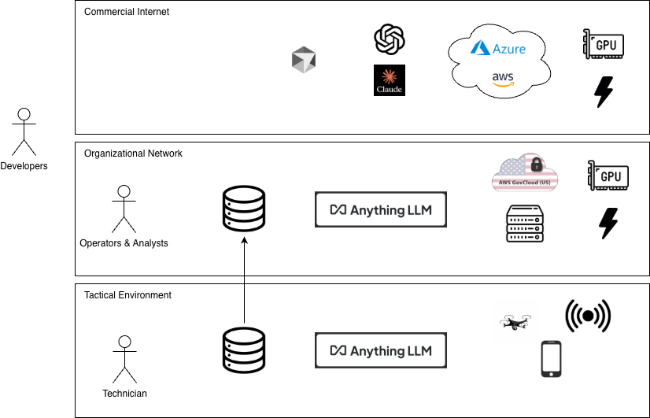

# AnythingLLM Demonstration
Website: https://anythingllm.com

Github: https://github.com/Mintplex-Labs/anything-llm

This repository documents and explains AnythingLLM's key features, use cases, and deployment considerations for specific audiences. All credit for this technology goes to the maintainers of the AnythingLLM platform. 

# What is AnythingLLM?
- AnythingLLM is an open source, MIT licensed, full-stack LLM platform. 
- You can power it with commercial LLMs or open source LLMs and vectorDB solutions. 
- The developers maintain rich feature sets that users and engineers expect from their AI tools. 
- It is best used to build a private ChatGPT that can run locally as well as host remotely.
- Role based accessed and chat workspace separation prevents user document "cross contamination".

# Why AnythingLLM?

As of January 2026, the text based chat and code-assist LLM ecosystem is saturating in access and product options. Users choose from a wealth of AI products in working environments that have three key elements to enable "10x workflow speed":

1. Data: word documents, excel spreadsheets, databases, and filesystems
2. Talented Users: analysts, administrative staff, engineers
3. AI/LLM Tech Stack: hardware/software infrastructure hosting the networks, models, webapps, & apis that give access to AI

These three elements are compulsory to the productive use of AI. 

## Example: Cursor for Software Development

The code-assist tool, Cursor, embodies a successful application of AI. Although AI-generated code introduces new engineering challenges still being addressed by the software development community, the presence of the three key elements has accelerated AI use in the space.

1. Data: The source code
2. Talented Users: software engineers
3. AI/LLM Tech Stack: Cursor's client runs locally on developer desktops. Under default configuration, it leverages the infrastructure, models, and APIs offered by frontier labs like Anthropic's Claude to provide AI token input/output. 

Cursor goes beyond simple chat and user-driven context modification through its agent and background service architectures that constantly and automatically combine LLM context with the source code data. Applications leveraging LLMs should strive for this level of integration to meet user expectations and produce the workflow benefits often asked for. 

## The Problem: Data and Networks

Data is valuable, dangerous, and protected. For professional use cases, it often lies in enterprise or private networks. If your data, use-case, and working environment infrastructure is commercial-internet friendly, then you are in luck! You can bring the entire AI ecosystem of tools to bear against your problem (as long as you have the funds).

However, this diagram shows where most of us are probably working, where the data sits, and the barriers we will run into when trying to hit an LLM.

## The Solution: AnythingLLM

AnythingLLM can be deployed in the middle of your network enclave and provide access to the AI ecosystem of tools to your data. However, it must be hosted somewhere with the requisite hardware. 

What are the (1) features, (2) LLM options, (3) deployment options and (4) key microservice components it provides? Refer to the AnythingLLM README at https://github.com/Mintplex-Labs/anything-llm/blob/master/README.md